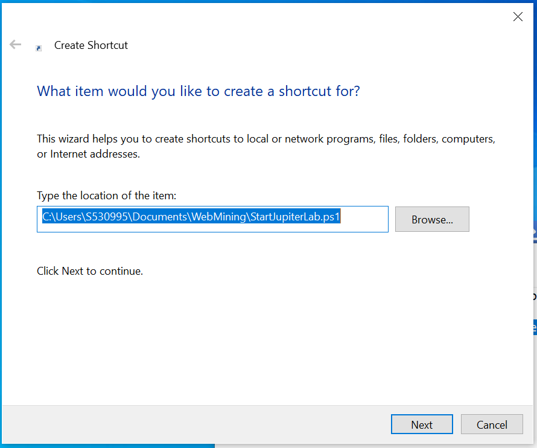
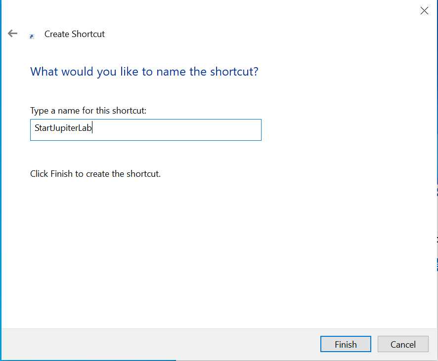
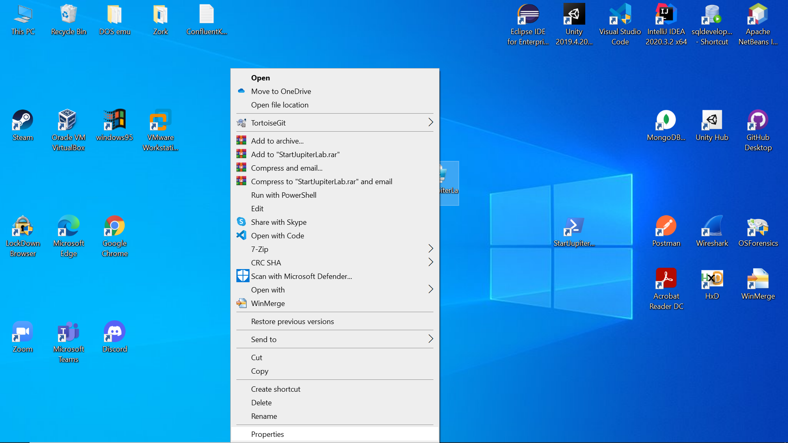
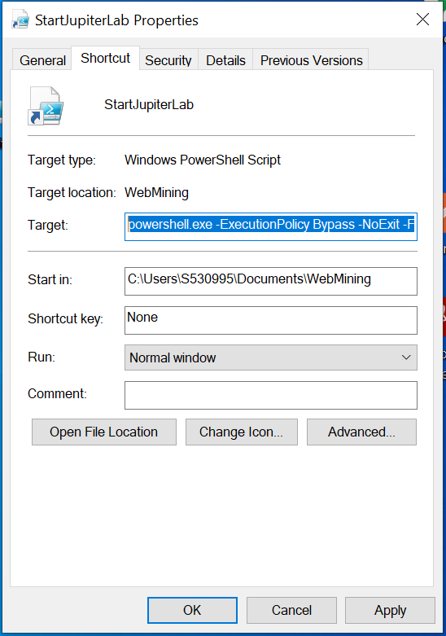

# Starting Jupyter Lab as Jupyter notebook using a Script__Also:Shortcut instructions included below

## Instructions:

#### 1.Download script and change in accordance with Instruction in file

```Powershell
cd {Location of envirment parent folder here}
Start-Process "http://localhost:8888/lab/" #uses default browser
.\{environmentName}\Scripts\activate # change name to that of your environment
jupyter notebook
```

#### 2. Place Script where you would like to keep it and create a shortcut on you Desktop
##### Create


##### ---Name


##### ---Go to Properties


##### ---add the following to the begining of the shorthcut target and insure running as Administrator
```Powershell
powershell.exe -ExecutionPolicy Bypass -NoExit -File {The File Location of the script that should have already been there}
```


#### ----Tips
- The Run as Administrator feature is in the Advanced Tab
- Jupyter_logo.ico is the Jupyter logo in the correct icon format to use for your shortcut's icon if you want


### Credit

https://www.tenforums.com/tutorials/97162-powershell-scripting-run-script-shortcut.html
